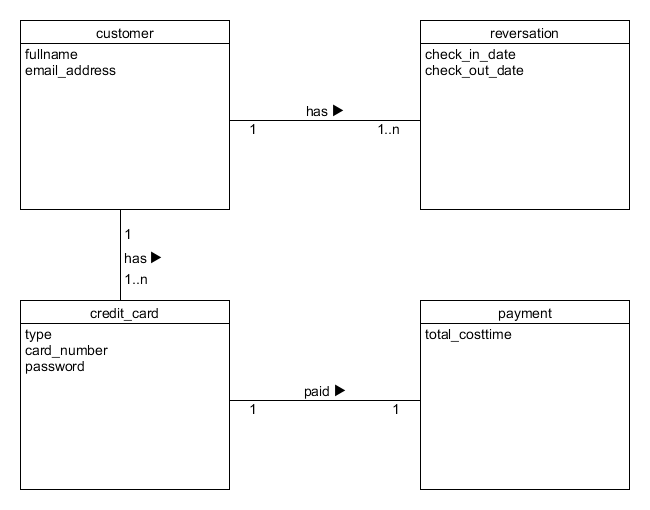
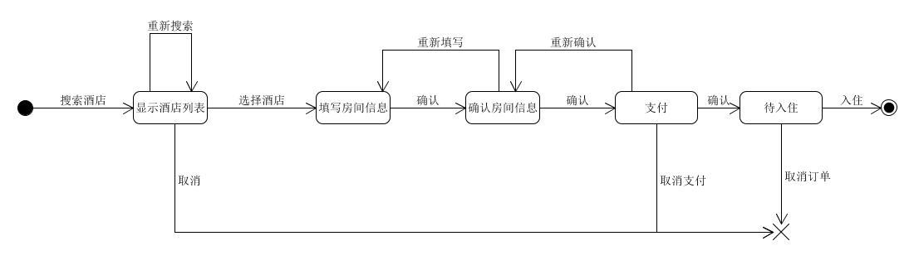

# 系统分析与作业第九周作业


使用 UMLet 建模

1、


- Make Reservation
  
    ````
    Hotel（ID/Key，name，city）
    Room(ID/Key, Type,price)
    customer(ID/Key, fullname,email_address)
    reversation(ID/Key, check_in_date,check_in_date
check_out_date)
    ````

- Payment
    
    ````

    customer(ID/Key, fullname,email_address)
    reversation(ID/Key, check_in_date,check_in_date
check_out_date)
    credit_card(ID/Key, card_number,password,type)
    payment(ID/Key, total_costtime)
    ````
2、
    
